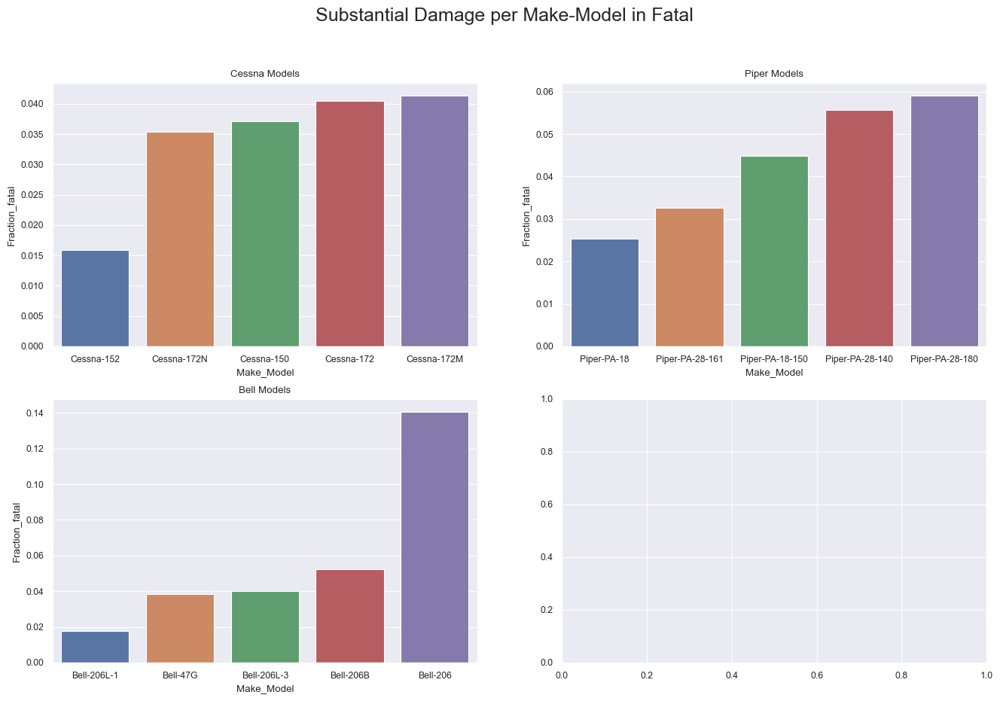

# Instructional Airplane Leasing Program

## Overview

This dataset details every accident investigated by the National Transportation Safety Board over the last 40 years.  This data details the make, models, weather conditions, flight phases, injuries, and deaths during each accident.  The data could potentially help organizations find correlations, and identify conditions of an airplane flight that make it safer.  

Key findings:
1. **Cessna** and **Piper** airplanes appear to offer better protection to its passengers during airplane accidents.
2. Accidents that occur during **taxi**, **takeoff**, and **landing** have the **lowest** fatalities rates.  Accidents that occur during **maneuvers** and **cruise** phases have the **highest** fatality rates. 
3. Flights occurring during the **summer** months tend to have **lower** fatality rates that flights occuring during the **winter** months.

## Business Problem

In order to choose safe airplanes for the flight school, we will investigate these business questions:
1. How does the make of the aircraft affect airplane safety?
2. How does the phase of flight affect the survivability of airplane accidents?
3. How do the time of year and weather conditions affect the survival rate an airplane accident? 

To measure airplane safety, we will consider the protection offered by the airplane during an accident.  We will look at this three different ways
- **Survive:** The fraction of accidents with no fatalities.  
- **Fraction Fatal:** The fraction of passengers killed during an accident
- **Fraction Uninjured:** The fraction of passengers uninjured during an accident. 

## Analysis

### Airplane Safety by Make of Aircraft

First, we will identify airplane manufacturers that make airplanes with the best protection during accidents.  To do this, we average the statistic survive across all accidents associated with each manufacturer, and graph the results. The graph shows that Cessna, Bell, and Piper aircraft offer the best protection during accidents.  There are no fatalities in 80% of accidents involving their aircraft.  Mooney and Beech perform 10% worse, with only 70% of accidents with their aircraft involving no fatalities.

    

    

When breaking down accidents further to consider whether aircraft sustain substantial damage or are destroyed, we find that Cessna, Bell, and Piper makes consistently offer the best protection of the five.

    

    
    

    

### Model Safety

Knowing the Cessna, Piper, and Bell offer the best protection during accidents, we look at specific models manufactured by each, and identify which are the safest.  Again, we break down the statistics to separately consider cases where aircraft are substantially damaged and destroyed.

    

    

Based on the above analysis, we compare the top 5 models, and find that the Cessna 172, Cessna 152, and Piper PA-28 are the safest light aircraft.  In the graph of fraction uninjured vs. model, we see these three aircrafts offer the best protection.

    

### Airplane Safety during Phases of Flight

To help our students become safer pilots, we consider which phases of flight have historically lead to the most accident fatalities in light weight aircraft.  Below, we consider the fraction of passengers killed during each phase of flight.  We find the maneuvering, climbing, and cruising are the most dangerous phases.

We discover similar results when considering an "inverse statistic", the fraction of passengers uninjured during accidents during each phase.

    

Calculating Heatmap

For fun, we break down how different aircraft make perform safety wise during different flight phases.  Our safeest manufacturers, Cessna and Bell, both encounter their most dangerous phases during maneuvering.

    

### Airplane Safety during Different Months of the Year

Finally, to support our students, we investigate which months of the year are correlated to the most deadly accidents.  In the graphs of month vs. fraction fatal and fraction uninjured below, we find that the winter months are correlated to higher fatality rates, and the summer months are correlated to the best survival rates.

    

## Conclusions

* Consider __Cessna__ or __Piper__ makes (Cessna 172, 158, or Piper PA-28)
* Focus on safety during __climb__, __cruize__, and __maneuvering__ phases of flight
* Focus on safety during __winter__ flying.

## Next Steps

* Investigate the geopraphical locations of accidents to gain insight.
* Investigate weather conditions.
